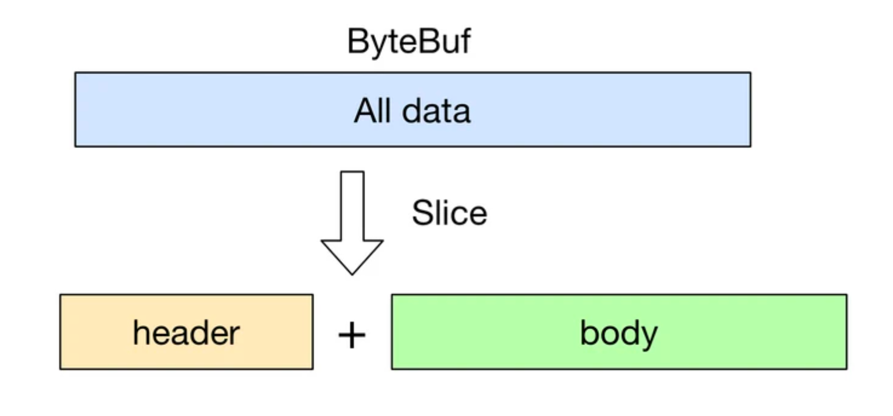

#Netty

##Netty 中的 Zero-copy
    Netty的 Zero-coyp 完全是在用户态(Java 层面)的,假设我们有一份协议数据, 它由头部和消息体组成, 而头部和消息体是分别存放在两个 ByteBuf 中的, 即:
    ByteBuf header = ...
    ByteBuf body = ...
    ByteBuf allBuf = Unpooled.buffer(header.readableBytes() + body.readableBytes());
    allBuf.writeBytes(header);
    allBuf.writeBytes(body);
将 header 和 body 都拷贝到了新的 allBuf 中了, 这无形中增加了两次额外的数据拷贝操作了.     

###CompositeByteBuf
    ByteBuf header = ...
    ByteBuf body = ...

    CompositeByteBuf compositeByteBuf = Unpooled.compositeBuffer();
    compositeByteBuf.addComponents(true, header, body);

CompositeByteBuf 只是逻辑上是一个整体.
###通过 wrap 操作实现零拷贝
    byte[] bytes = ...
    ByteBuf byteBuf = Unpooled.buffer();
    byteBuf.writeBytes(bytes);
    byte[] bytes = ...
    ByteBuf byteBuf = Unpooled.wrappedBuffer(bytes);
可以看到, 我们通过 Unpooled.wrappedBuffer 方法来将 bytes 包装成为一个 UnpooledHeapByteBuf 对象, 而在包装的过程中, 是不会有拷贝操作的. 即最后我们生成的生成的 ByteBuf 对象是和 bytes 数组共用了同一个存储空间, 对 bytes 的修改也会反映到 ByteBuf 对象中.
###通过 slice 操作实现零拷贝
    public ByteBuf slice();
    public ByteBuf slice(int index, int length);
    ByteBuf byteBuf = ...
    ByteBuf header = byteBuf.slice(0, 5);
    ByteBuf body = byteBuf.slice(5, 10);
用 slice 方法产生 header 和 body 的过程是没有拷贝操作的, header 和 body 对象在内部其实是共享了 byteBuf 存储空间的不同部分而已

###通过 FileRegion 实现零拷贝
Netty 中使用 FileRegion 实现文件传输的零拷贝, 不过在底层 FileRegion 是依赖于 Java NIO FileChannel.transfer 的零拷贝功能.

当有了 FileRegion 后, 我们就可以直接通过它将文件的内容直接写入 Channel 中, 而不需要像传统的做法: 拷贝文件内容到临时 buffer, 然后再将 buffer 写入 Channel. 通过这样的零拷贝操作, 无疑对传输大文件很有帮助.

转：https://segmentfault.com/a/1190000007560884
